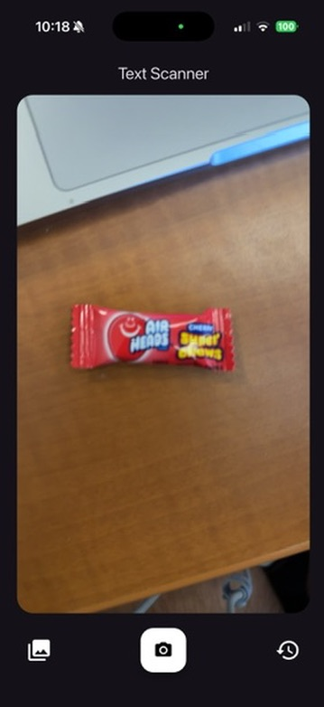
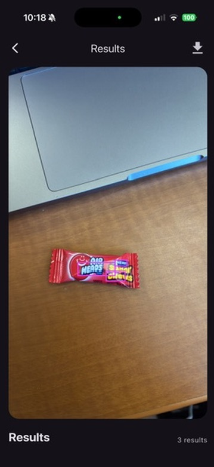
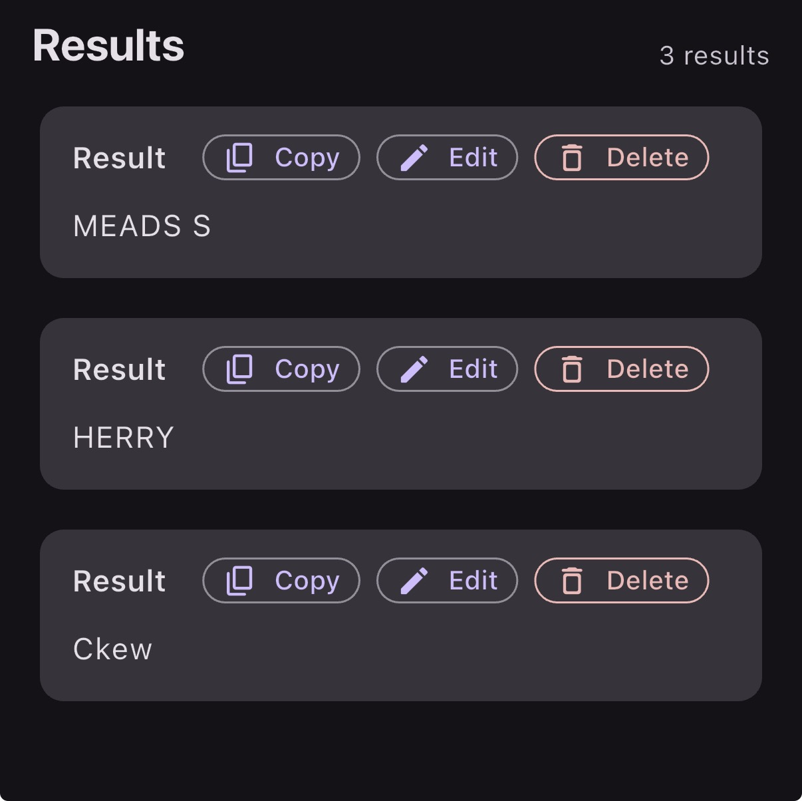
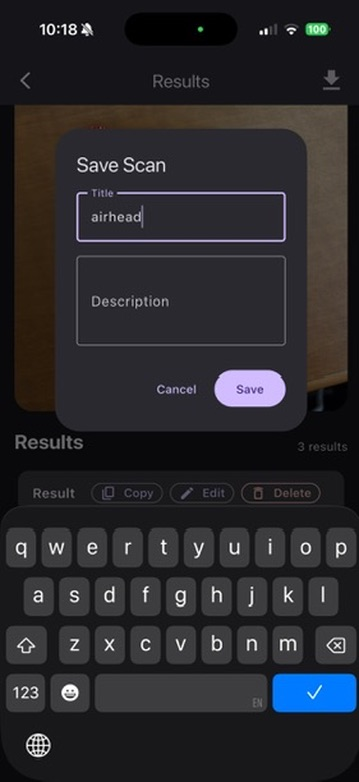
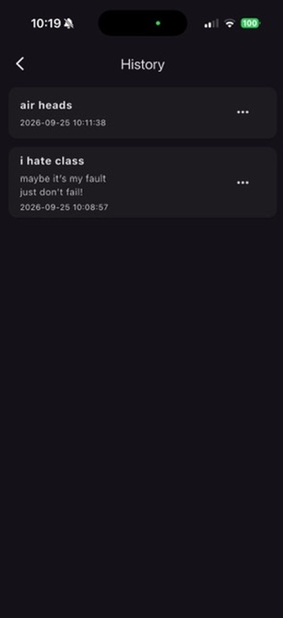
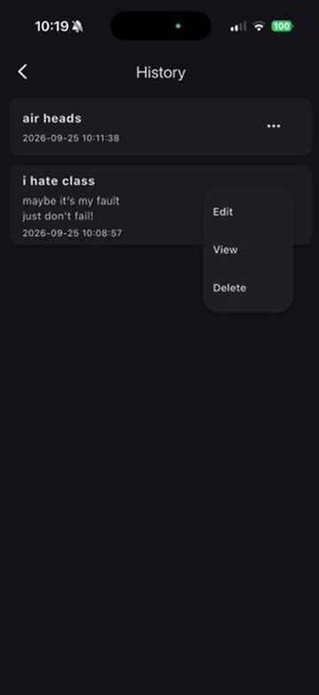
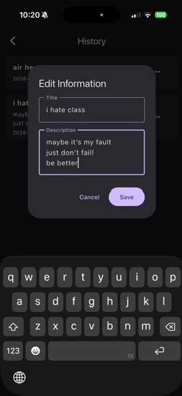
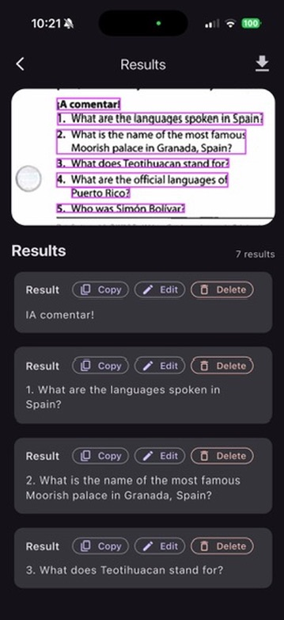

# Text Scanner

An application to scan text and copy text from an image, as well as save and edit inconsistencies.

## Development

For development, iOS seems to work the best,

```bash
flutter clean
flutter pub get
flutter run
```

## Accuracy

While the scan results are not entirely accurate on images that are not screenshot, it can still occasionally get most of the text. If the text is not left to right, top to bottom, the scanner will not recognize it at all.

## Contributing

Pull requests and issues are welcome. Issues are prefered, as it allows communicating about the idea.

## Screenshots










## License

[MIT](https://choosealicense.com/licenses/mit/)